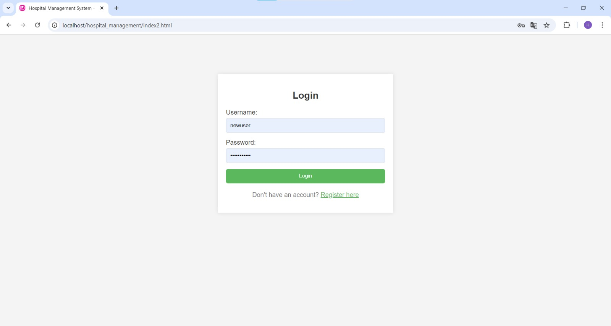
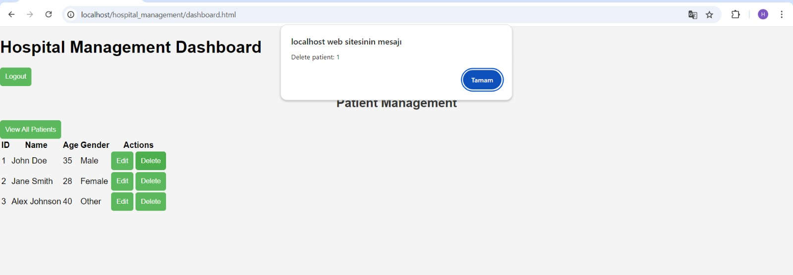
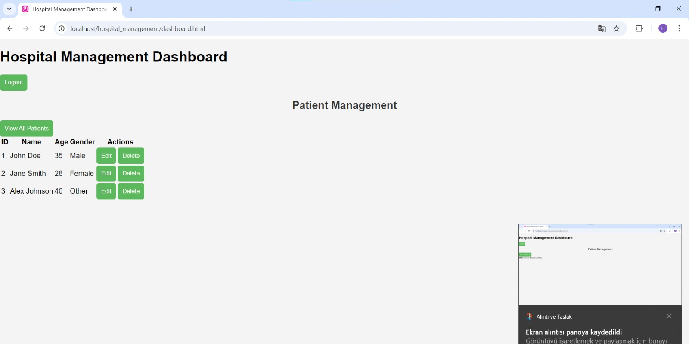

# About-Internship

This repository contains the work, technologies learned, and projects developed during my 4-week internship. Throughout the internship, I worked on web development, SQL database management, and C programming.

## Contents

### Week 1 (05/08/2024 - 09/08/2024)
- **Installation and basic usage of Visual Studio Code**
- **Learning the basics of HTML, CSS, and JavaScript**
- **Installed XAMPP and MySQL**
- Explored MySQL Workbench and phpMyAdmin
- Noted port issues encountered with XAMPP (included in Week 2 or 3 reports)

### Week 2 (12/08/2024 - 16/08/2024)
- **Installed MySQL and WAMP Server**
- Practiced **SQL queries** for database management
- Started **web development process**
- Worked on **[script.js](./path_to_script.js) and [index2.html](./path_to_index2.html) in Visual Studio Code**
- **Tested database and website connectivity**
- Switched from **XAMPP to WAMP Server** to resolve compatibility issues

### Week 3 (19/08/2024 - 23/08/2024)
- Continued developing the **Hospital Management System** website
- **Expanded database design** and created relational tables
- Worked on the **ER Diagram** and detailed relationships (1:1, 1:N, N:M)
- **ISA relationships** were incorporated into the ER model
- Developed **user login and registration system** for the website
- Executed **SQL queries on a movie dataset**

### Week 4 (26/08/2024 - 30/08/2024)
- **Prepared project documentation** and performed code refinements
- **Created GitHub repository:** `About-Internship`
- **Set up C programming environment using MSYS2 and Code Runner**
- Solved **8 Queens problem in C** and wrote algorithm explanations
- Conducted **detailed SQL studies** and tested various scenarios
- **Finalized documentation and reporting tasks**

## Technologies Used
- **Frontend:** HTML, CSS, JavaScript
- **Backend:** PHP, SQL (MySQL)
- **Development Environment:** Visual Studio Code, WAMP Server, XAMPP
- **Database:** MySQL
- **Other Tools:** MSYS2, Code Runner, GitHub

## Installation
1. Download and install **Visual Studio Code**
2. Install and run **WAMP Server**
3. Create a **MySQL database** and import the necessary tables ([SQL Script](./path_to_database.sql))
4. Modify files like **[index2.html](./path_to_index2.html) and [script.js](./path_to_script.js)** to further develop the project
5. Install **MSYS2** and necessary libraries for C projects

## Sample SQL Queries
```sql
-- Creating a sample table
CREATE TABLE movies (
    movie_id INT PRIMARY KEY,
    title VARCHAR(255),
    release_year INT,
    duration INT
);

-- Inserting sample data
INSERT INTO movies (movie_id, title, release_year, duration) VALUES
(1, 'Inception', 2010, 148),
(2, 'Interstellar', 2014, 169);

-- Retrieving movies released after 2010
SELECT * FROM movies WHERE release_year > 2010;
```
## Project Screenshots

### 1. Login Page


### 2. Website Main View


### 3. Additional Page View


## Contact
If you have any questions or would like to contribute to the project, feel free to reach out.
